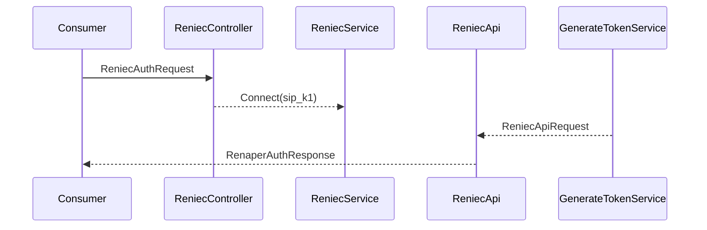
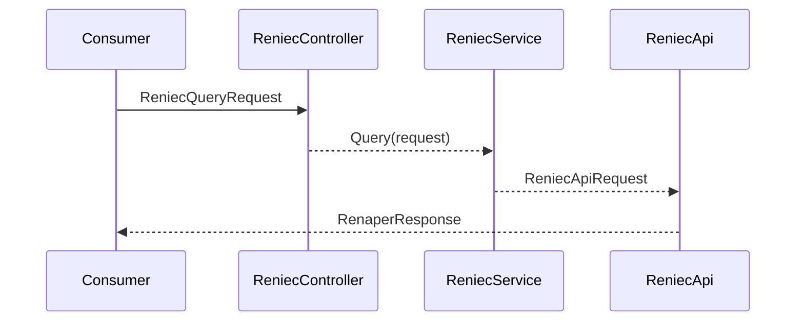
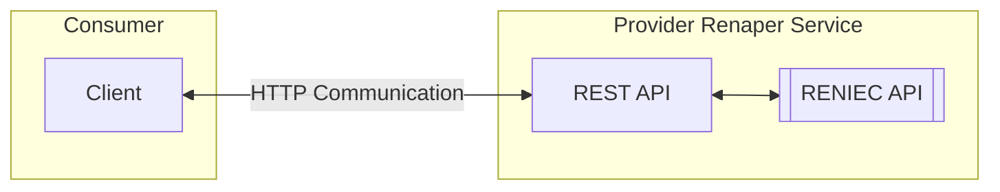

# Reniec

## Index:

- [Reniec](#reniec)
  - [Index:](#index)
  - [1. Description](#1-description)
  - [2. Use Cases](#2-use-cases)
    - [Connect](#connect)
    - [Query](#query)
  - [3. Architecture](#3-architecture)
    - [Architecture diagram](#architecture-diagram)
    - [Diagram description](#diagram-description)
    - [File structure](#file-structure)
    - [Development tools, libraries, and technologies](#development-tools-libraries-and-technologies)
    - [Software design pattern](#software-design-pattern)
  - [4. Run Locally](#4-run-locally)
    - [Step 1: Install node (min: v16)](#step-1-install-node-min-v16)
    - [Step 2: Run npm install](#step-2-run-npm-install)
    - [Step 3: Configure enviroment file](#step-3-configure-enviroment-file)
    - [Step 4: Run npm run start:dev](#step-4-run-npm-run-startdev)
  - [5. Deployment](#5-deployment)
    - [Step n: title step n](#step-n-title-step-n)
  - [6. Example Projects](#6-example-projects)
  - [7. Postman Collection / Swagger](#7-postman-collection--swagger)
  - [8. Errors](#8-errors)
    - [Installation errors](#installation-errors)
    - [Errors during development](#errors-during-development)
  - [9. Git branching strategy](#9-git-branching-strategy)
  - [10. Conventions, regulations and/or reference formats](#10-conventions-regulations-andor-reference-formats)
  - [11. Useful Links](#11-useful-links)

## 1. Description

This project is a REST API to consume the services exposed by RENIEC.

it has two endpoints / use case for that service

## 2. Use Cases

### Connect

### Query

## 3. Architecture

### Architecture diagram

[Ver todas las figuras que ofrece mermaid](https://mermaid-js.github.io/mermaid/#/flowchart). Algunas de ellas:

### Diagram description

This service exposes two endpoints that connect to the RENIEC API

### File structure

- devops - Files for helmchart
- src
  - config - Configuration enviroment variables
  - dto 
- test
- .env.example

### Development tools, libraries, and technologies

 This project has been created in node using the [Nestjs framework](https://nestjs.com/)

### Software design pattern

## 4. Run Locally

### Step 1: Install node (min: v16)

If you do not have it, you need to [download and install node](https://nodejs.org/es/)

### Step 2: Run npm install

Open your terminal, go to the renaper folder and run the following command **npm install** for install all package.json dependencies

### Step 3: Configure [enviroment file](.env.example)

- PORT=443
- HOST=apiid.appsconfirma.com
- URL_BASE=https://apiid.appsconfirma.com
- SIP_K1= 'K1 provided by RENIEC'
- SIP_USER= 'USER provided by RENIEC'

### Step 4: Run npm run start:dev

Open your terminal and run the following command **npm run start:dev**

## 5. Deployment

Notas generales antes de proceder. Como paso final se realizará una pequeña prueba que demuestre su correcto despliegue.

### Step n: title step n

- Definición del paso n.
- Comandos / código necesario a ejecutar en el paso n.
- Consejos para el paso n (si es pertinente)

## 6. Example Projects

There are no sample projects yet.

## 7. Postman Collection / Swagger

Postman Collection: [Reniec](reniec_postman_collection.json)

Swagger
 - localhost: http://localhost:3000/api
 - staging: 
 - production:

## 8. Errors

### Installation errors

No bugs found yet.

### Errors during development

No errors found yet.

## 9. Git branching strategy

Branchs:
 - develop
 - master

## 10. Conventions, regulations and/or reference formats

- The changelog format is based on: [Keep a Changelog](https://keepachangelog.com/en/1.0.0/)

- The version change format is based on: [Semantic Versioning](https://semver.org/spec/v2.0.0.html)

- The date format is based on: [ISO-8601](https://www.iso.org/iso-8601-date-and-time-format.html)

- The languages format is based on: [ISO-639-1](https://en.wikipedia.org/wiki/List_of_ISO_639-1_codes)

## 11. Useful Links

Lista con todos los links que puedan resultar de utilidad.